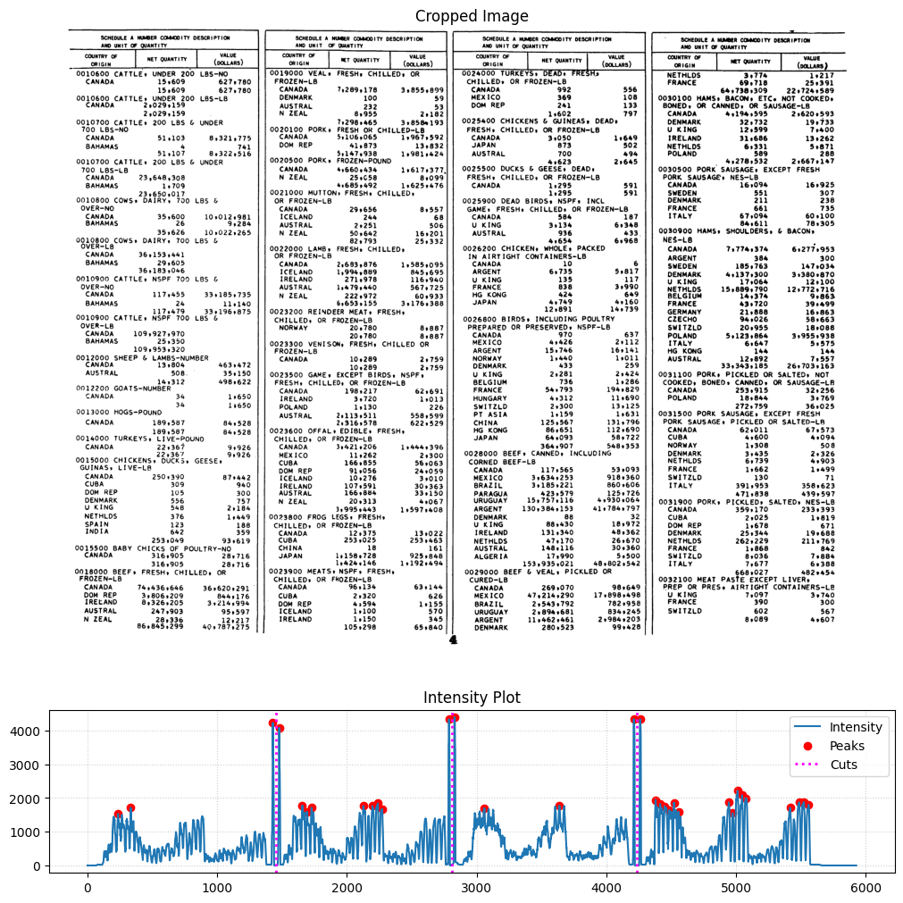
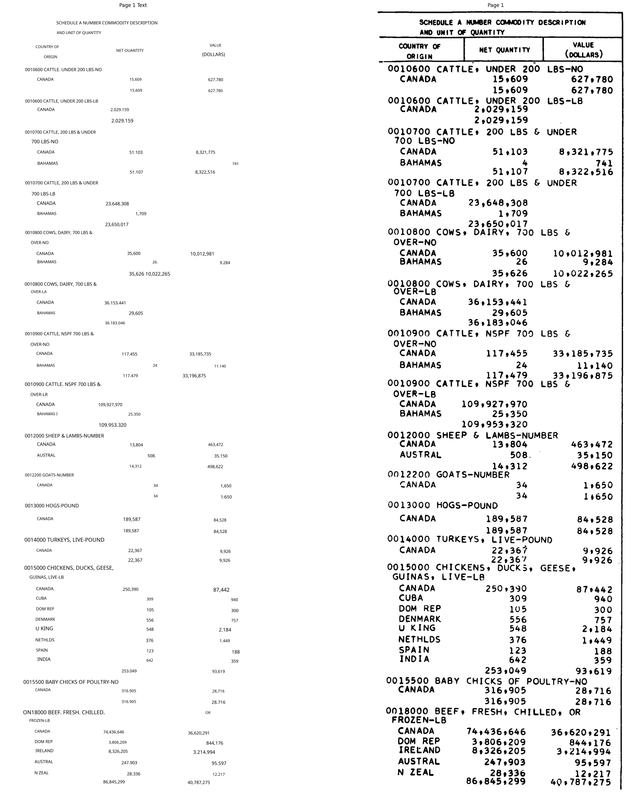

# OCR Tariff \& Trade Data from 20th Century

## Overview \& Introduction

This repository outlines some thoughts, work, example on trying to digitise historical trade data in an uncommon layout. I show the efforts to digitise the 1951 data. I employ Surya-OCR and heuristic pre and post-processing to extract data. The PDF folder contains the input pdf, the Code file contains my files, Output contains the results. I do not include all the images in their files for storage efficiency reasons; running the codes will populate the Images, Temp_PNG, PNG, Output folders with all the associated images. 

## Process

Firstly, I pre-process the PDFs to identify text blocks using heuristic methods- example shown below: 

Secondly, I run inference using Surya-OCR. 

Additionally, I also deskew images, and post-process the JSON into a csv. 

## Results

Overall, I retrieve correct import quantity and value for just over 85% of products (8852/10393). The Output file contains the processed OCR output csv 'semi-final' and the Results.JSON

## To Do

I plan to add the following:

- Add further post-processing ideas- both in R and in the conversion from JSON to csv. 
- Explore more pre-processing ideas.
- Run different OCR settings on pages that contain problematic quantities/values.
- Employ post-processing on 'country' and 'product_description' as well. 
